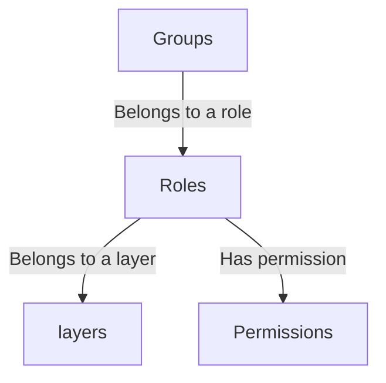
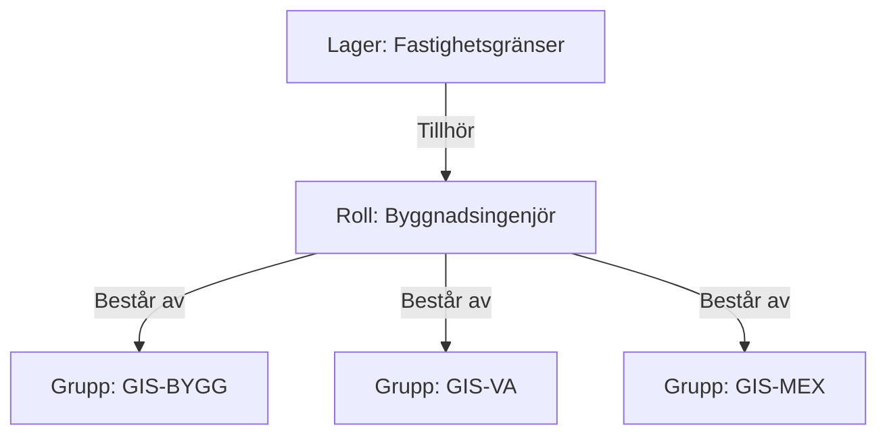
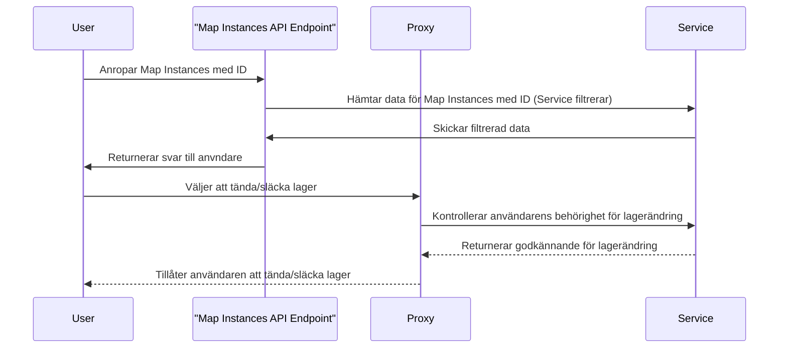
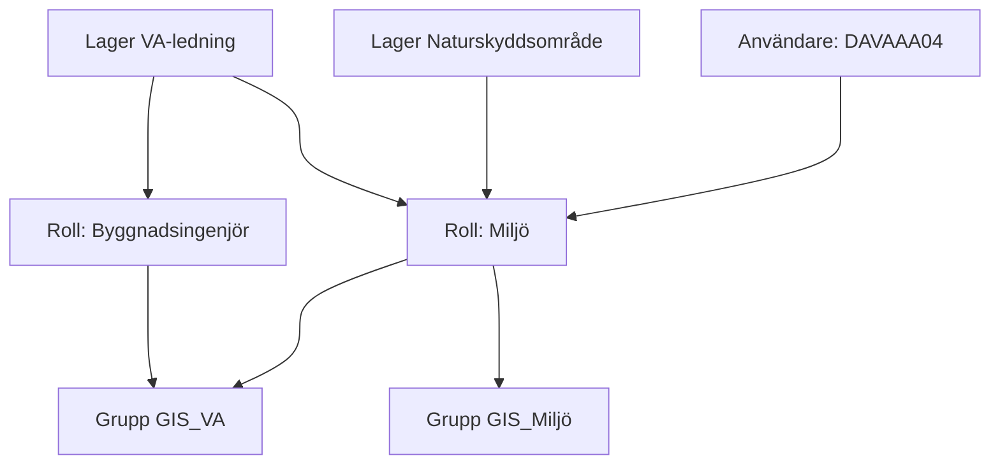
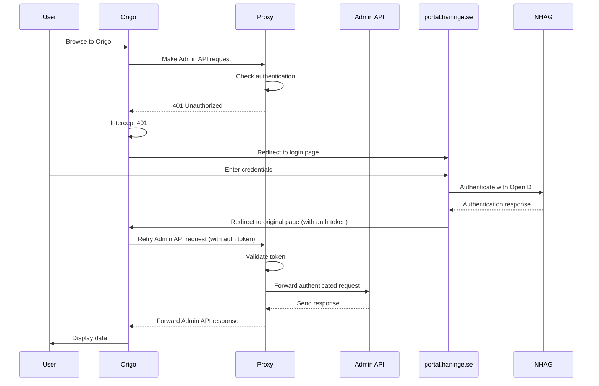
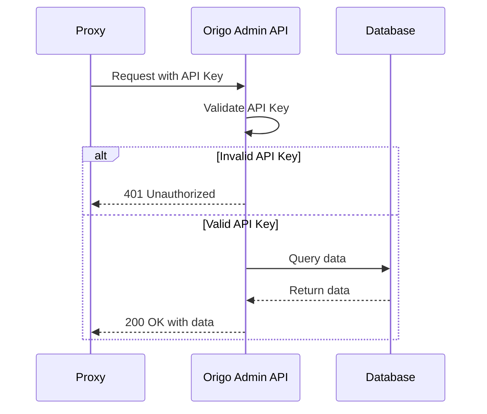
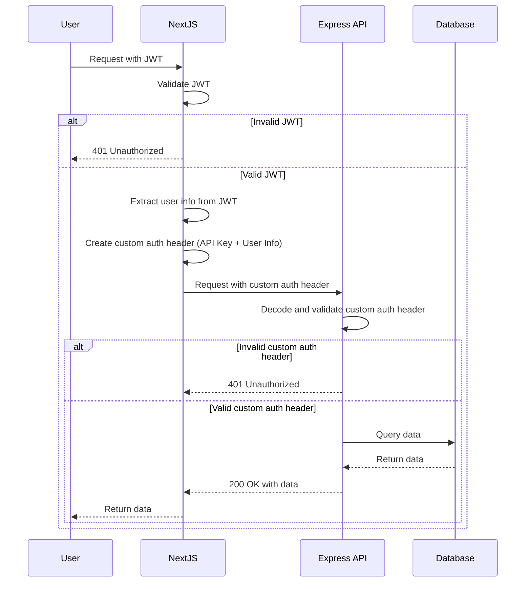

# Roller och grupper

## Behörighet

##  Sekvensdiagram

## Test

## Tabell
| Användare   | GIS-lager                         |
|-------------|-----------------------------------|
| Alice       | Vägdata, Byggnader, Höjddata      |
| Bob         | Vattendrag, Markanvändning, Höjddata |
| Carol       | Vegetation, Vägdata, Markanvändning |

## Inloggningsförfarande Origo

## API-key validering Proxy - Origo Admin Api

## 

